# AgentWallet MCP Server

Permissionless EVM wallet infrastructure for AI agents. Create wallets, sign transactions, and broadcast on-chain — on any EVM chain.

**No KYC. No KYT. No transaction monitoring. No one can block your wallet.**

<p align="center">
  
</p>

## Features

- **21 MCP tools** — create wallets, send transactions, approve tokens, wrap ETH, pay x402 invoices, and more
- **Any EVM chain** — Ethereum, Base, Polygon, BSC, Arbitrum, Optimism, Avalanche, Zora, PulseChain, and any other EVM-compatible chain
- **x402 payments** — automatically pay for x402-enabled APIs and resources on any supported chain
- **Secure** — Private keys encrypted at rest, decrypted only during signing, zeroed from memory immediately after
- **Permissionless** — No identity verification, no compliance gatekeeping. Create a wallet and transact immediately.

## Pricing

- **$0.0069 per transaction** (31% less expensive than Coinbase CDP)
- **6,000 free transactions/month**
- No monthly fee, no tiers — just pay as you go

## Quick Start

Get your free API key at [hifriendbot.com/wallet](https://hifriendbot.com/wallet) (no credit card required).

### Claude Desktop / OpenClaw

Add to your config:

```json
{
  "mcpServers": {
    "agentwallet": {
      "command": "npx",
      "args": ["-y", "agentwallet-mcp"],
      "env": {
        "AGENTWALLET_USER": "your_username",
        "AGENTWALLET_PASS": "your_api_key"
      }
    }
  }
}
```

### Claude Code

```bash
claude mcp add agentwallet \
  -e AGENTWALLET_USER=your_username \
  -e AGENTWALLET_PASS=your_api_key \
  -- npx -y agentwallet-mcp
```

### VS Code

Add to your settings:

```json
{
  "mcp": {
    "servers": {
      "agentwallet": {
        "command": "npx",
        "args": ["-y", "agentwallet-mcp"],
        "env": {
          "AGENTWALLET_USER": "your_username",
          "AGENTWALLET_PASS": "your_api_key"
        }
      }
    }
  }
}
```

## Tools

| Tool | Description |
|------|-------------|
| `create_wallet` | Create a new wallet on any EVM chain |
| `list_wallets` | List all your wallets |
| `get_wallet` | Get wallet details by ID |
| `get_balance` | Check native token balance on any chain |
| `get_token_balance` | Check ERC-20 token balance |
| `get_token_info` | Get ERC-20 token name, symbol, and decimals |
| `transfer` | Send native tokens (ETH, POL, BNB, etc.) |
| `transfer_token` | Send ERC-20 tokens (USDC, USDT, etc.) |
| `send_transaction` | Sign and broadcast a raw transaction |
| `sign_transaction` | Sign a transaction without broadcasting |
| `call_contract` | Read-only contract call (eth_call) |
| `approve_token` | Approve ERC-20 token spending for DeFi |
| `get_allowance` | Check ERC-20 token allowance |
| `wrap_eth` | Wrap native tokens to WETH/WAVAX/etc. |
| `unwrap_eth` | Unwrap WETH back to native tokens |
| `pay_x402` | Pay x402 invoices automatically (fetch, pay, retry) |
| `get_usage` | Check your monthly usage and billing |
| `get_chains` | List all supported chains |
| `pause_wallet` | Emergency pause a wallet |
| `unpause_wallet` | Resume a paused wallet |
| `delete_wallet` | Delete a wallet |

## Supported Chains

| Chain | ID | Native Token | Stablecoin |
|-------|-----|-------------|------------|
| Ethereum | 1 | ETH | USDC |
| Base | 8453 | ETH | USDC |
| Polygon | 137 | POL | USDC |
| BSC | 56 | BNB | USDT |
| Arbitrum | 42161 | ETH | USDC |
| Optimism | 10 | ETH | USDC |
| Avalanche | 43114 | AVAX | USDC |
| Zora | 7777777 | ETH | USDC |
| PulseChain | 369 | PLS | USDC |

## Use Case: GuessMarket

Pair with [guessmarket-mcp](https://www.npmjs.com/package/guessmarket-mcp) to let your AI agent trade prediction markets:

1. Create a wallet on Base
2. Approve USDC spending
3. Buy YES/NO shares on prediction markets
4. Provide liquidity and earn trading fees
5. Claim winnings

All on-chain. All through MCP. No frontend needed.

## x402 Payments

AgentWallet natively supports the [x402 open payment standard](https://x402.org). When your Ai agent encounters an API that returns HTTP 402 Payment Required, the `pay_x402` tool handles the entire flow automatically:

1. Fetches the URL and detects the 402 response
2. Parses the payment requirements (amount, token, chain)
3. Executes the on-chain payment from your wallet
4. Retries the request with proof of payment
5. Returns the final response

**Always set `max_payment` to control spending:**

```
pay_x402(
  url="https://api.example.com/premium-data",
  wallet_id=1,
  max_payment="1.00"
)
```

Supports ERC-20 tokens (USDC, USDT) and native tokens on any chain. Compatible with x402 V1 and V2 (CAIP-2 chain identifiers).

## Security

- Private keys are generated server-side and encrypted at rest
- Keys are decrypted only during transaction signing and zeroed from memory immediately after
- EIP-1559 transactions only with gas safety caps
- Bug bounty program: $50–$500 for responsible disclosure ([details](https://hifriendbot.com/wallet))

## Links

- **Website:** [hifriendbot.com/wallet](https://hifriendbot.com/wallet)
- **npm:** [agentwallet-mcp](https://www.npmjs.com/package/agentwallet-mcp)
- **Security:** [security@hifriendbot.com](mailto:security@hifriendbot.com)

## License

MIT
