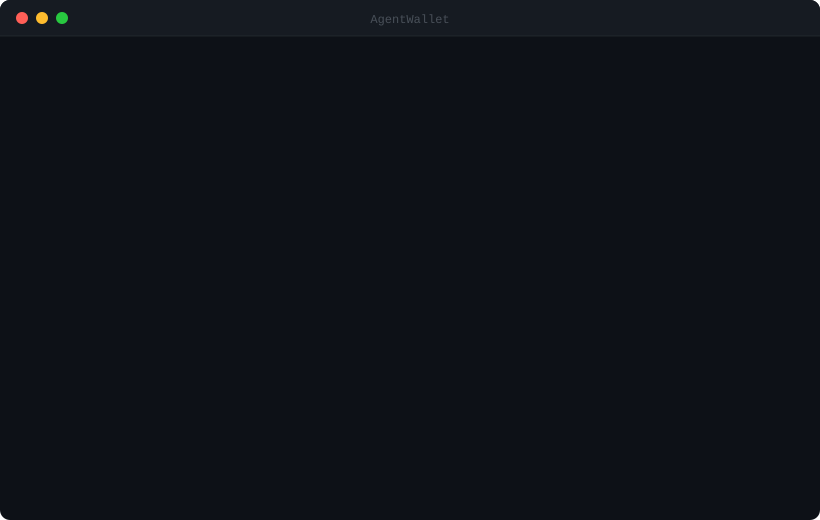

# AgentWallet MCP Server

Permissionless wallet infrastructure for AI agents. Create wallets, sign transactions, and broadcast on-chain, on any EVM chain and Solana. Built-in guards. No KYC. The only AI agent wallet that accepts crypto for its own API fees.

**Your keys can stay on your machine.** Set one environment variable and every signature happens in your own process. No server sees the key, no company can freeze the wallet, and you can verify that claim by reading `src/local-wallet.ts` or by running the server with the API pointed at a closed port.

**No KYC. No KYT. No approval process. No transaction monitoring. No one can block your wallet. Pay with USDC on-chain, no credit card required.**

## Two modes

| | Local (self-custody) | Hosted (custodial) |
|---|---|---|
| Who holds the key | You, in your own process | Encrypted on AgentWallet servers |
| Set up | One env var, no account needed | API key |
| Chains | EVM + Solana | EVM + Solana |
| Can anyone freeze it | No | Yes, that is what pause is for |
| Spend guards | `AGENTWALLET_MAX_TX_NATIVE`, `AGENTWALLET_MAX_TX_SOL`, `AGENTWALLET_MAX_AUTOPAY` | Server-side limits, pause, rate limits |
| Paywalls, usage, billing | Needs an API key too | Included |

Run `wallet_mode` at any time and the server will tell you which one you are in, and which address it controls.

### Local signing in one variable

```json
{
  "mcpServers": {
    "agentwallet": {
      "command": "npx",
      "args": ["-y", "agentwallet-mcp"],
      "env": {
        "AGENTWALLET_PRIVATE_KEY": "0xyour_key",
        "AGENTWALLET_RPC_8453": "https://your-own-rpc",
        "AGENTWALLET_MAX_TX_NATIVE": "0.05"
      }
    }
  }
}
```

Use `AGENTWALLET_KEYFILE=/path/to/key` instead if you would rather keep the key out of your shell config. The key is read once, never written to disk, never logged, and never included in an error message.

`AGENTWALLET_RPC_<chainId>` (or `AGENTWALLET_RPC_URL` for all chains) points at an endpoint you trust. Without it a public RPC is used, and a public RPC can see which addresses you ask about.

`AGENTWALLET_MAX_TX_NATIVE` is a per-transaction ceiling in native units (ETH, MATIC and so on). In hosted mode the server enforces limits; in local mode there is no server, so these guards are the only ones there are. Set them.

`AGENTWALLET_MAX_TX_TOKEN` is the equivalent ceiling for ERC-20 movement, in human units of the token. **Set this one too if you hold stablecoins.** The native cap cannot see a token transfer: an ERC-20 send carries `value = 0` with the amount in the calldata, so `AGENTWALLET_MAX_TX_NATIVE` alone leaves a USDC balance uncapped. `AGENTWALLET_MAX_TX_TOKEN` covers `transfer`, `transferFrom` and `approve`, the last because an unbounded allowance is a drain waiting to happen. Decimals are resolved locally; unknown tokens are evaluated at 6 decimals, the tightest common value, so it fails closed rather than open.

### Solana local signing

```json
"env": {
  "AGENTWALLET_SOLANA_KEY": "[12,34...]",
  "AGENTWALLET_SOLANA_RPC": "https://your-own-rpc",
  "AGENTWALLET_MAX_TX_SOL": "1"
}
```

Accepts whichever format you already have: a `solana-keygen` id.json array, a base58 secret key as exported by Phantom, or base64. Use `AGENTWALLET_SOLANA_KEYFILE` to point at a file instead. Native SOL and SPL token transfers are both signed locally, and a missing associated token account is created for the recipient automatically.

Set either key, or both. They are independent: run EVM locally and Solana hosted, or the reverse.

**An operation with no matching local key is refused, never silently routed to the hosted signer.** If you have an EVM key configured and ask for a Solana transfer with no Solana key, the server stops and tells you which variable is missing. Quietly moving funds onto a key you do not hold, while you believe you are in self-custody, is the worst thing this server could do.

### About the dependency tree

Local signing uses [viem](https://viem.sh) for EVM and `@solana/web3.js` for Solana, plus `bs58` for key parsing. SPL instructions are built by hand rather than with `@solana/spl-token`, because that package pulls in `bigint-buffer`, which carries a high severity buffer overflow advisory. A wallet has no business shipping that to save a dozen lines of instruction encoding.

`npm audit` currently reports issues inside `@modelcontextprotocol/sdk`'s HTTP transport dependencies. This server speaks stdio, so that code never loads, and the SDK is not something this package can patch. Run the audit yourself. Publishing a tree you can inspect is the point.

<p align="center">
  
</p>

## Features

- **31 MCP tools**: create wallets, send transactions, approve tokens, wrap ETH, transfer SPL tokens, pay and accept x402 payments, verify custody mode, and more
- **EVM + Solana**: Ethereum, Base, Polygon, BSC, Arbitrum, Optimism, Avalanche, Zora, PulseChain, Solana, and any other EVM-compatible chain
- **SOL + SPL tokens**: native SOL transfers and SPL token transfers (USDC, USDT, etc.) with automatic account creation
- **Built-in guards**: daily spending limits, gas price protection, emergency pause, rate limiting, replay protection, and on-chain verification, all active by default
- **x402 payments**: pay for x402-enabled APIs automatically, or accept x402 payments on your own endpoints (EVM and Solana)
- **Self-custody option**: run local mode and the key never leaves your machine. In hosted mode, keys are encrypted at rest, decrypted only during signing, and zeroed from memory immediately after. Either way you can export and walk away.
- **Permissionless**: No KYC. No KYT. No identity verification. No approval process. No compliance gatekeeping. Sign up, get an API key, and start transacting immediately.
- **30-second setup**: three lines of config. No SDK to install. No dependencies to manage.

## Pricing

- **$0.00345 per operation**
- **6,000 free operations/month**
- **$0.0005 per x402 verification**
- **1,000 free x402 verifications/month**
- **Pay with USDC on-chain** via x402, no credit card required
- No monthly fee, no tiers, just pay as you go

Competitor comparisons are kept at [hifriendbot.com/wallet/#pricing](https://hifriendbot.com/wallet/#pricing) with the date they were last verified. They live there rather than here because a published npm README cannot be corrected when someone else changes their prices.

## Quick Start

Get your free API key at [hifriendbot.com/wallet](https://hifriendbot.com/wallet), no credit card required, no KYC, no approval wait.

### Claude Desktop / OpenClaw

Add to your config:

```json
{
  "mcpServers": {
    "agentwallet": {
      "command": "npx",
      "args": ["-y", "agentwallet-mcp"],
      "env": {
        "AGENTWALLET_USER": "your_username",
        "AGENTWALLET_PASS": "your_api_key",
        "AGENTWALLET_WALLET_ID": "1"
      }
    }
  }
}
```

> `AGENTWALLET_WALLET_ID` is optional. Set it to enable x402 auto-pay: when you exceed the free tier without a credit card, the MCP server automatically pays for operations with USDC from this wallet.
>
> **Auto-pay safety cap.** `AGENTWALLET_MAX_AUTOPAY` (optional, default `1`) is the maximum amount, in human-readable units of the asset, that x402 auto-pay will authorize for a single payment. Any 402 requirement above this cap is rejected instead of paid, so a malformed or tampered payment requirement cannot drain the wallet. Raise it only if you genuinely need larger automatic payments (for example `"5"` to allow up to 5 USDC per call).

### Claude Code

```bash
claude mcp add agentwallet \
  -e AGENTWALLET_USER=your_username \
  -e AGENTWALLET_PASS=your_api_key \
  -e AGENTWALLET_WALLET_ID=1 \
  -- npx -y agentwallet-mcp
```

### VS Code

Add to your settings:

```json
{
  "mcp": {
    "servers": {
      "agentwallet": {
        "command": "npx",
        "args": ["-y", "agentwallet-mcp"],
        "env": {
          "AGENTWALLET_USER": "your_username",
          "AGENTWALLET_PASS": "your_api_key",
          "AGENTWALLET_WALLET_ID": "1"
        }
      }
    }
  }
}
```

## Tools

| Tool | Description |
|------|-------------|
| `create_wallet` | Create a new EVM or Solana wallet |
| `list_wallets` | List all your wallets |
| `get_wallet` | Get wallet details by ID |
| `get_balance` | Check native token balance on any chain |
| `get_token_balance` | Check ERC-20 or SPL token balance |
| `get_token_info` | Get ERC-20 token name, symbol, and decimals |
| `transfer` | Send native tokens (ETH, SOL, POL, BNB, etc.) |
| `transfer_token` | Send ERC-20 or SPL tokens (USDC, USDT, etc.) |
| `send_transaction` | Sign and broadcast a raw transaction |
| `sign_transaction` | Sign a transaction without broadcasting |
| `call_contract` | Read-only contract call (eth_call) |
| `approve_token` | Approve ERC-20 token spending for DeFi |
| `get_allowance` | Check ERC-20 token allowance |
| `wrap_eth` | Wrap native tokens to WETH/WAVAX/etc. |
| `unwrap_eth` | Unwrap WETH back to native tokens |
| `pay_x402` | Pay x402 invoices automatically (fetch, pay, retry) |
| `create_paywall` | Create an x402 paywall to charge for a resource |
| `list_paywalls` | List all your x402 paywalls |
| `get_paywall` | Get paywall details by ID |
| `update_paywall` | Update paywall pricing, resource, or status |
| `delete_paywall` | Delete a paywall |
| `get_paywall_payments` | View payment history for a paywall |
| `get_x402_revenue` | Aggregate revenue stats across all paywalls |
| `wallet_mode` | Report whether signing is local (self-custody) or hosted, and which address is in use |
| `export_wallet_key` | How to export a hosted wallet key and move to self-custody |
| `buy_verification_credits` | Buy x402 verification credits with USDC on-chain |
| `get_usage` | Check your monthly usage and billing |
| `get_chains` | List all supported chains |
| `pause_wallet` | Emergency pause a wallet |
| `unpause_wallet` | Resume a paused wallet |
| `delete_wallet` | Delete a wallet |

## Supported Chains

| Chain | ID | Native Token | Stablecoin |
|-------|-----|-------------|------------|
| Ethereum | 1 | ETH | USDC |
| Base | 8453 | ETH | USDC |
| Polygon | 137 | POL | USDC |
| BSC | 56 | BNB | USDT |
| Arbitrum | 42161 | ETH | USDC |
| Optimism | 10 | ETH | USDC |
| Avalanche | 43114 | AVAX | USDC |
| Zora | 7777777 | ETH | USDC |
| PulseChain | 369 | PLS | USDC |
| Solana | 900 | SOL | USDC |
| Solana Devnet | 901 | SOL | USDC |

## Use Case: GuessMarket

Pair with [guessmarket-mcp](https://www.npmjs.com/package/guessmarket-mcp) to let your AI agent trade prediction markets:

1. Create a wallet on Base
2. Approve USDC spending
3. Buy YES/NO shares on prediction markets
4. Provide liquidity and earn trading fees
5. Claim winnings

All on-chain. All through MCP. No frontend needed.

## x402 Payments

AgentWallet natively supports the [x402 open payment standard](https://x402.org). When your Ai agent encounters an API that returns HTTP 402 Payment Required, the `pay_x402` tool handles the entire flow automatically:

1. Fetches the URL and detects the 402 response
2. Parses the payment requirements (amount, token, chain)
3. Executes the on-chain payment from your wallet
4. Retries the request with proof of payment
5. Returns the final response

**Set `max_payment` to control spending:**

```
pay_x402(
  url="https://api.example.com/premium-data",
  wallet_id=1,
  max_payment="1.00"
)
```

`max_payment` is enforced as a hard per-payment cap. If you omit it, `pay_x402` falls back to `AGENTWALLET_MAX_AUTOPAY` (default `1`), the same cap the auto-pay path uses, so a malicious or compromised 402 endpoint can never authorize an unbounded payment. Set `max_payment` explicitly (or raise `AGENTWALLET_MAX_AUTOPAY`) to allow a larger single payment.

Supports ERC-20 tokens, SPL tokens, and native tokens on EVM and Solana. Compatible with x402 V1 and V2 (CAIP-2 chain identifiers), and reads the token address from the standard x402 `asset` field (falling back to `extra.token`).

## x402 Acceptance

AgentWallet also lets you **accept** x402 payments. Create a paywall, point it at any resource, and get a public URL that charges agents automatically:

```
create_paywall(
  wallet_id=1,
  name="Premium API",
  amount="0.01",
  token_name="USDC",
  token_address="0x833589fCD6eDb6E08f4c7C32D4f71b54bdA02913",
  chain_id=8453,
  resource_url="https://your-api.com/data"
)
```

When an agent hits the paywall URL:
1. Gets back HTTP 402 with payment requirements
2. Pays on-chain using `pay_x402` (or any x402-compatible client)
3. Retries with proof of payment
4. Receives the protected content

On-chain verification ensures every payment is real. Replay protection prevents double-spending. Revenue tracking shows you who paid, how much, and when. 1,000 free verifications/month, then $0.0005 each. See the [pricing comparison](https://hifriendbot.com/wallet/#pricing) for how that stacks up.

## How We Compare

| Feature | Coinbase CDP | AgentWallet |
|---------|-------------|-------------|
| Setup Time | Install SDK + configure | **3 lines of config** |
| Approval Process | Identity verification required | **None, instant access** |
| KYC Required | Yes | **No** |
| KYT / Transaction Monitoring | Yes | **No** |
| Can Block Your Wallet | Yes | **No** |
| Built-in Guards | Yes (requires setup) | **Yes (active by default)** |
| Free Operations / Month | 5,000 | **6,000** |
| Cost Per Operation | $0.005 | **$0.00345** |
| x402 Verification Cost | $0.001 | **$0.0005** |
| Free x402 Verifications / Month | 1,000 | **1,000** |
| x402 Acceptance (Paywalls) | No | **Yes** |
| Pay for API Fees with Crypto | No (credit card only) | **Yes (USDC via x402)** |
| Supported Chains | 8 EVM + Solana | **Any EVM + Solana** |
| Token Tools | Yes | **ERC-20 + SPL (29 tools)** |
| MCP Server | Yes | **Yes** |

## Pay with Crypto, No Credit Card Required

AgentWallet is the only AI agent wallet infrastructure that accepts crypto for its own API fees. Every competitor, Coinbase CDP, Circle, MoonPay, Crossmint, Turnkey, requires a credit card or monthly invoice. With AgentWallet, your agent can pay for operations with USDC on-chain via the x402 protocol. No credit card, no invoice, no billing portal. Just on-chain payments.

When your agent exceeds the free tier (6,000 ops/month) without a credit card configured, the API returns HTTP 402 with USDC payment instructions. Your agent pays on-chain, retries with proof of payment, and the operation executes. Fully automated via the MCP server.

You can also pre-purchase x402 verification credits with USDC using the `buy_verification_credits` tool, keeping your paywalls running beyond the free 1,000 verifications/month without needing a credit card.

## Built-in Guards

All guards are active by default, no configuration required.

- **Encrypted at rest**: private keys encrypted before storage and never leave the server
- **Memory zeroing**: keys wiped from memory immediately after every signing operation
- **Daily spending limits**: set a per-wallet daily cap in USD, enforced automatically on every transaction
- **Gas price protection**: transactions blocked when gas prices spike above safe thresholds
- **Emergency pause**: instantly freeze any wallet or all wallets with one click
- **Rate limiting**: API requests capped per minute to prevent abuse and brute force attacks
- **Replay protection**: every x402 payment verified on-chain with unique transaction tracking
- **On-chain verification**: x402 payments verified directly on the blockchain with finalized commitment
- Bug bounty program: $50,$500 for responsible disclosure ([details](https://hifriendbot.com/wallet))

## Links

- **Website:** [hifriendbot.com/wallet](https://hifriendbot.com/wallet)
- **npm:** [agentwallet-mcp](https://www.npmjs.com/package/agentwallet-mcp)
- **Security:** [security@hifriendbot.com](mailto:security@hifriendbot.com)


## Security

`pay_x402` validates the target URL before every outbound request and again on
each redirect hop. IP literals are canonicalized (including IPv4-mapped IPv6
such as `[::ffff:127.0.0.1]`) and hostnames are resolved, with loopback,
private, link-local, carrier-grade NAT, multicast and cloud-metadata
destinations refused.

Validation and connection use the same DNS answer. Each hop resolves once, and
the socket is pinned to an address from that answer, so a hostname cannot
resolve public for the check and private for the connection. The hostname is
still used for the `Host` header and for TLS SNI and certificate validation, so
pinning is invisible to legitimate endpoints.

Report security issues privately to security@hifriendbot.com.

## License

MIT
